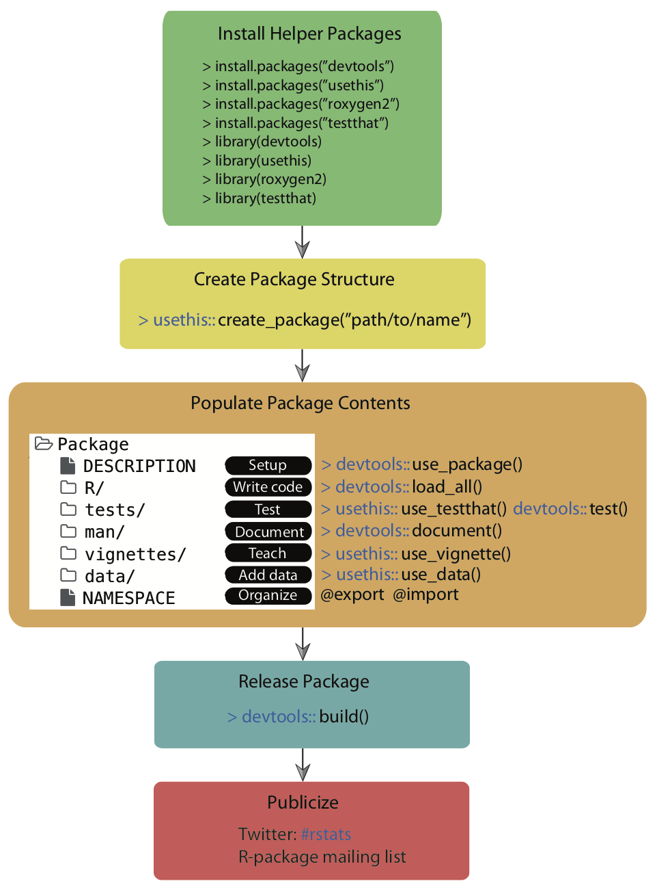
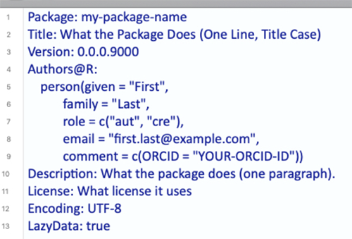
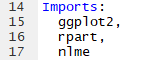
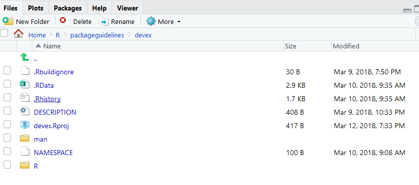

# Package Development

The following graphic outlines this entire chapter:




As a quick reminder, you can find the `devex` example package linked [here, on GitHub](https://github.com/IQSS/Rbuild/tree/master/devex), if you'd like to look through it while reading the guide.

## Downloading Development Tools

There are a collection of development tools in R that make much of the package development cycle easier than ever before. Below are the list of packages needed to work with our development workflow.


```r
library('devtools')
```

```
## Loading required package: usethis
```

```r
library('usethis')
library('roxygen2')
library('testthat')
```

```
## 
## Attaching package: 'testthat'
```

```
## The following object is masked from 'package:devtools':
## 
##     test_file
```

Before we get started, 


you'll want to download four packages that are extremely useful for package development. For Mac/Linux users, head to the R Gui (or your favorite IDE) and run the code below to download the packages. If you are prompted to choose a CRAN mirror for your session, simply pick the mirror closest to your location.


```r
install.packages('devtools')
install.packages('usethis')
install.packages('roxygen2')
install.packages('testthat')
```

If you are using Windows, prior to running the above code, you will need to install "RTools" by following these instructions:

1. Go to https://cran.rstudio.com/ and select "Download R for Windows."

2. Click "RTools" and download the latest version of the tools (or the tools that are compatible with your version of R).

3. Let the installer run itself (the defaults are fine).

## Initializing the Package

Now we can begin to walk through the process of creating an R package. The first thing you'll always want to do is run the following function to initialize the package:


```r
usethis::create_package('path/to/desired/location/packagename')
```

Note that the path specified by `usethis::create_package()` must currently be empty, otherwise `usethis` will throw an error. Successfully running this function will create a couple of important files which constitute a skeletal outline of the package. In particular, it will create:

1. An 'R' subdirectory in the root of your specified directory, which is where all of core the R code of your package will live.
2. A DESCRIPTION file, which will come with a couple of preset fields.
3. A NAMESPACE file.

You can then set the working directory for your project to an "active" status:


```r
usethis::proj_set('path/to/desired/location/packagename')
```

Once you've set up the basic structure of your package, you can start modifying files and writing it in earnest!

## File Paths

The paths used to locate files differ between UNIX (e.g., MacOS, Linux) and Windows based operating systems. Windows systems used a single backslash `\`, while UNIX systems use a single forward slash `/` to delimit files or directories in the path. R follows the UNIX convention of using forward slashes, but forces this on Window's users too. So, file paths should look like this:

1. MacOS and Linux

`~/Documents/myproject/myRfile.R`

2. Windows

`C:/Documents/myproject/myRfile.R`

In the examples provided in this guide, we will show MacOS file paths. If you're using Windows, you will need to modify these paths slightly to show the drive letter at the beginning, followed by a colon.


## The DESCRIPTION

The DESCRIPTION file gives an extremely brief overview to the package. It includes critical information such as the author of the package, the title, a very short summary of its purpose, and the licensing information. Open the "DESCRIPTION" file using your favorite text editor in order to inspect and edit its contents.

DESCRIPTION is a DCF file (Debian control format). This file format may be unfamiliar, but it's quite simple. Each line contains a field name and value, separated by a colon. Sometimes, values are long enough to require multiple lines, in which case they are indented by four spaces. For example, the DESCRIPTION file for a newly created package will look like this:

```


```




Let's go through the fields and discuss what they mean. The first seven fields listed are mandatory, meaning that if you do not include them, the development environment will throw an error later on when you're trying to build your package.

1. **Package**: This is the name of the package. It should match the package name you chose earlier, and you should probably just leave this as is.
2. **Title**: A short but more descriptive title of your package than its name.
3. **Version**: The version of your package. Since you're creating this package for the first time, presumably it's version 0.1.0.
4. **Authors**: Here, you should add in your given and family names, role, email, and (optionally) your ORCID.
5. **Description**: This should be a one-paragraph *comprehensive* description of the package. It is necessarily a high level-description, but it should be a complete one.
6. **License**: You should add in a License, which describes how others can legally use the package. Most of the time (especially in the US), you should write 'CC0' in the License field, which implies that the package is open for all use, and you have relinquished all your rights to it. For more information on various licensing options, click [this link](https://cran.r-project.org/doc/manuals/r-release/R-exts.html#Licensing).
7. **Encoding**: Just leave this as "UTF-8"; discussing what encodings are isn't super important for this guide. If you're dying to learn about encodings, visit [this webpage](https://www.w3.org/International/questions/qa-what-is-encoding).
8. **LazyData**: Just leave this as 'true', which ensures that if you include any data with your package (which you frequently will), when another user loads your package, they won't automatically load up the data, but will only load it if it becomes necessary during their use. This option reduces the amount of RAM users have to expend when loading packages, especially if you are planning to include a lot of data with your package.

(Note all of the fields from this point on are optional, but encouraged!)

9. **Type**: This describes what type of project you're creating - in this case, because you're creating a package, you should write "Package."
10. **Date**: The date, in YYYY-MM-DD fashion.
11. **RoxygenNote**: Roxygen will automatically fill in the version of `Roxygen2` used to build the package in this field.

(These fields are exceptionally important if you are building a package using tools from other packages)

12. **Imports**: In this field, you should list the packages which your package needs to function. Each package should be indented by two spaces, separated by a comma, and given its own line. For example, a package which requires `ggplot2`, `nlme`, and `rpart` might have an 'imports' field which looks like this:


```r

```


<!--     -->

13. **Suggests**: Sometimes, your package will not really *require* the use of other packages, but it might offer a couple of extra wrappers/functions with those other packages. When those extra functions aren't strictly necessary, it's a good idea to have your package *suggest* imports. For example, a package which includes the following function should include `ggplot2` in the 'suggests' part of the description.


```r
scalep <- function(d, x=1){
  ...
  # If ggplot2 is available, use its qplot function - else, use the default hist function
  if (requireNamespace("ggplot2", quietly = TRUE)) {
    ggplot2::qplot(r, geom='histogram')
  } else {
    hist(r)
  }
  ...
}
```

Here, the function `requireNameSpace()` checks if `ggplot2` is available, and if not, the function uses the (slightly less pretty) default histogram function.

Once you know which packages to list in the 'suggests' section, you can list them exactly the same way you'd list functions in the 'imports' section: each package is indented by two spaces, separated by a comma, and gets its own line.

In general, it's best to suggest functions instead of requiring them if you barely use them in your package. This will give users a bit more flexibility, because it won't force them to download packages they will probably never use.

## Writing Code

### General Coding Guidelines

All of your code should be in scripts in the 'R' file created in the package development environment, as shown below:




The coding you will do in package development is slightly different than the coding you'll normally do when writing R scripts. This is for a couple of reasons:

1. When you write a script and load that script using `source("script_name")`, the code in the script runs when you load it (specifically, when you run the `source()` command). On the other hand, the code in a package is run when the package is *built* on your computer. As a result, your code should mostly be focused on building functions, as opposed to a series of actions which the computer ought to take.
2. Unlike your personal scripts, other people will be using your package, and if your package is good, they'll be using it in ways you didn't anticipate. This means you ought to really try to make sure your code is as general as possible and can support a variety of approaches and implementations.
3. Also, because other people will be using your package, you should avoid modifying the global environment with your package. This means avoiding using functions like `require()`, `library()`, or `source()`; instead, there are other alternatives which can accomplish the same goal without changing the global environment and potentially giving other users an unwanted surprise. For example, instead of using `library()` and `require()`, you should be listing your necessary imports in the DESCRIPTION file, as outlined above, and then R will make sure anyone who installs and loads your package also has any other packages your package depends on. The one catch is that you'll now have to append `packagename::` in front of the imported functions you want to use, otherwise R won't recognize them. For example, to use the `qplot()` function from the `ggplot2` package, the code should look like:


```r
 ...
scalep <- function(d, x=1){
 ...
  ggplot2::qplot(r, geom='histogram')
 ...
}
```

The last thing you should know is that if you want your package to plot things, you will have to surround the `plot()` commands with a `print()` statement, like this:


```r
 ...
scalep <- function(d, x=1){
 ...
  print(ggplot2::qplot(r, geom='histogram'))
 ...
}
```


You should also take care to organize your functions properly. It's probably a bad idea to stick them all into one script and title it "functions." Instead, you should organize functions by their purposes - for example, a variety of loss functions might go into a single script. Of course, some very complicated functions might deserve their own script. The file names of the script should be descriptive - for example, a script of loss functions might be named "loss_functions.R".

### Code Style

Now let's talk about code style. These recommendations are shortened and adapted from [Hadley Wickham's book](http://r-pkgs.had.co.nz/r.html), which in turn were adapted from Google's style guide.

1. **Comments**: Comments are the best way to make your code readable. In general, you should err on the side of commenting too much rather than too little, and your comments should explain the *motivation* of your code as opposed to what your code actually does (although admittedly the line between those two things is a bit blurry). Moreover, you can use lines of '# ---------------------------' or '# ==================' to separate sections of your code. Here are some examples:


```r
# Returns the squared element-wise difference between two vectors
loss <- function(x,y) {
  error <- (x-y)**2
  return(error)
}
#---------------------------------------------------------------------------

# Takes the square root of any real number, returning a complex number
general_sqrt <- function (x) {
  # Return the normal square root if x > 0
  if (x > 0 || x == 0) {
    return(complex(real=sqrt(x), imaginary=0))
  }
  # Else return the complex square root
  else {
    return(complex(real = 0, imaginary = sqrt(-x)))
  }
}
```

2. **Names**: Variable and function names should be descriptive but concise, and variable names should generally be nouns whereas function names tend to be verbs. Most R developers keep their function/variable names all lowercase and separate multiple words with underscores. There are no strict rules on this, but it's nice to be consistent with *some* rules because it makes your code readable.


```r
# Bad example - function name
f <- function(x) {
  return(sqrt(x))
}

# Good example - function name
take_sqrt <- function(x){
  return(sqrt(x))
}

# Bad example - variable name
s <- read.table(path)

# Good example - variable name
car_data <- read.table(path)
```

3. **Curly Braces**: You should start a new line after you write an opening curly brace, and ending curly braces should get their own lines, unless you have an else clause or the line is exceptionally simple.


```r
# Bad examples

if (condition) {
  complicated_function(x)} # Ending curly brace should get a new line

# Good examples
if (condition) {do(x)} else {do(y)}

if (condition) {
  complicated_function_call(arg1, arg2, arg3)
} else {
  other_complex_function_call(arg7, arg3, arg5)
}
```

As always, you can break the rules if you have a good reason to.

Different organizations and programmers may have different styles, but in general, you should remember:

1. Your goal should always be to make your code readable!
2. Whatever style guide you follow, follow it *consistently*.
3. When in doubt, follow the conventions of the organization you're working for.

### Warnings and Simplicity

Consider the case of the `scalep()` function, which currently takes a 2-column dataframe as an input, divides the second column by the first, and returns/graphs some scaled proportion of the quotient vector. One version of this function, which follows almost all of the guidelines above, might look like this:


```r
scalep <- function(d, x=1){

  # Intialize resulting vector
  result <- c()

  # Iterate through and divide column 2 of d by column 1 of d
  i <- 0
  while(i < length(d[ ,1]) + 1){
    row <- d[i,]
    result <- append(result, row[[2]]/row[[1]])
    i <- i + 1
  }

  # Print the graph using either ggplot2 or the hist function
  if (requireNamespace("ggplot2", quietly = TRUE)) {
    print(ggplot2::qplot(result, geom='histogram'))
  } else {
    print(hist(result))
  }

  # Return the result, multiplying by the optional scalar
  result <- x*result
  return(result)
}
```

However, this function still has a couple of problems. It's not super easy to use because (a) it's understandably hard for other programmers to remember which column is divided by which and (b) there's a simpler way to accomplish the code above which will make it more readable. Specifically, it might be easier to just have arguments called 'factors' and 'divisors' and then divide them, like this:


```r
scalep <- function(factors, divisors, constant = 1) {

  # Divide and multiply by optional scalar
  proportions <- constant*factors/divisors

  # Print the graph using either ggplot2 or the hist function
  if (requireNamespace("ggplot2", quietly = TRUE)) {
    print(ggplot2::qplot(proportions, geom='histogram'))
  } else {
    print(hist(proportions))
  }

  # Return the result
  return(proportions)
}
```

The new argument structure will make it a bit easier to use. Similarly, the new structure simplifies the code, making it a bit more readable. However, it does pose one problem: whereas the previous structure mandated that the two vectors be the same length (because they were part of a dataframe), in this function, the two vectors might not be the same length and the function would not always throw an error (specifically, if 'factors' has a length which is is an integer multiple of the length of 'divisors', R will not warn the user at all). This problem is a type of **silent error** (silent errors are bugs which do not issue warnings or errors). Silent errors are terrible because they make bug-hunting extremely difficult: in large repositories of code, it becomes nearly impossible to find which specific line is causing problems without some kind of warning. Thus, it's also worth adding in a couple of lines to warn the user if the factors and divisors are of different lengths, as is outlined below:


```r
  # Check divisors and factors are the same length
  if (length(divisors) != length(factors)) {
    warning('Length of divisors argument is not equal to length of factors argument')
  }
```

Lastly, it's just worth adding an extra optional argument to let your users turn off the graphing feature of `scalep()`, just to make the function more useable, as follows:


```r
scalep <- function(factors, divisors, constant = 1, graph = FALSE) {

  ...

  # If graph = True, print the graph using either ggplot2 or the hist function
  if (requireNamespace("ggplot2", quietly = TRUE) & graph) {
    print(ggplot2::qplot(proportions, geom='histogram'))
  } else if (graph) {
    print(hist(proportions))
  }

  ...
```


To summarize, this subsection thus contained three core ideas: (1) make your code simple, (2) make it easy to use by labeling arguments, and (3) always avoid silent errors.

### Loading Your Code

If you've finished writing your code and want to play with it a little bit, you can use the following function:


```r
devtools::load_all()
```

which (according to its documentation) "roughly simulates what happens when a package is installed and loaded with library." As we'll see in the [build](#releasing-your-package), [testing](#testing), and [RStudio](./integrated-development-environments.html#ex-building-packages) sections, there are better ways to simulate the user experience and test your code, but `load_all()` is often a useful intermediate step.
