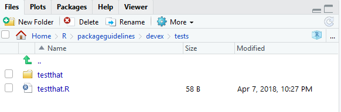
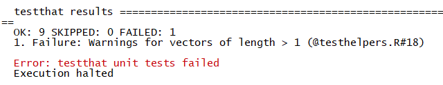
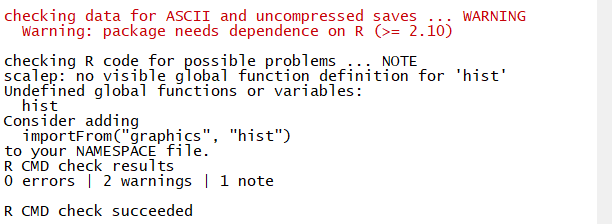
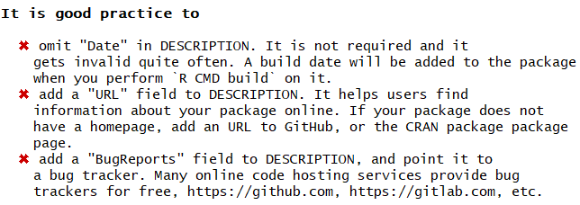

## Why should you test?

Suppose an imaginary programmer named Grace has created a package and has been using it for a while, but she decides she'd like to modify one function to improve it. She modifies her function, tests it a bit, and then publishes a new version of the package. Yet two weeks later, another imaginary programmer named Carlos discovers that the changes she made created a bug in *another* function in the package! This situation is very annoying, especially if Carlos has no idea what has caused the bug or how to fix it. Unfortunately, it's also an extremely common problem.

The solution to problems like this is to test your package *systematically* and *automatically*. If Grace had rigorously tested the entire package before publishing it, Carlos would never have had to deal with the new bug- Grace would have found out immediately. In other words, a good principle in package development is to make sure your code *fails as fast as possible,* so you can find out and fix it. Of course, all programmers test their code, but not everyone tests systematically and automatically.


## What are unit tests?

Tests compare the *expected* output of a block of code to its *actual* output. For example, the following test tests whether the "generalized square root" function actually returns $2$ as the square root of $4$.


```r
expect_equal(general_sqrt(4), complex(real = 2, imaginary = 0))
```

*Unit tests* usually run on the computer of the developer who is modifying a package and also should run automatically upon building a package.

We'll talk a little more about how exactly to create tests below, but hopefully this makes the general concept clear (you've also probably been using the general concept as you program).

### Setting up the testing environment

Creating unit tests is actually quite easy, thanks to a package called `testthat` which works in combination with `usethis`. To begin, you should run the following command in your favorite IDE, or even in the R Gui:


```r
usethis::use_testthat()
```

This will do a couple of things. First, it will add `testthat` to the Suggests part of the DESCRIPTION, which will help other collaborators know to use `testthat` when modifying/working on the package. It will also create a 'tests/testthat' directory in your project, as well a file called 'test/testthat.R', as shown below.



### Expectations

Before discussing how to write unit tests, we need to properly describe an expectation. An expectation tests whether the actual output of a single function call is what the developer expected. The `testthat` package has a number of functions which compare outputs to expected values. When calling one of these functions, one of two things can happen:

1. If the actual output matches the expectation, nothing will happen!
2. If the actual output does not match the expectation, it will throw an error.

For example, `expect_equal()` uses the base R function `all.equal()` to check whether an output is (approximately) equal to an expectation. In the following code, the first function call will do nothing - the second function call will throw an error, displayed below.


```r
library(testthat)
testthat::expect_equal(2, 2)
testthat::expect_equal(2, 4)
```


Here's an (abbreviated) list of the expectation functions:

1. **expect_equal**, as aforementioned, checks equality using the "all.equal()" base function.
2. **expect_identical** checks equality using the `identical()` base function. Generally, it's better to use `expect_equal()` because lots of R functions use numerical approximations which will cause expect_identical to fail when you don't want it to.
3. **expect_match**, **expect_output**, **expect_message**, **expect_warning**, and **expect_error** all respectively test whether a string, output, warning, or error match a regular expression. For example, the following two expectations functions will not throw errors:


```r
testthat::expect_match('hello1234', 'hello')
testthat::expect_warning(sqrt(-2), 'NaNs produced')
```
The tests do not fail because (i) 'hello1234' contains 'hello' and (ii) the error message produced by `sqrt(-2)` contains the phrase 'NaNs produced'.

4. **expect_is** tests whether an object inherits from a class, specified in quotes. For example, the following test passes:


```r
testthat::expect_is(sqrt(2), 'numeric')
```

```
## Warning: `expect_is()` was deprecated in the 3rd edition.
## i Use `expect_type()`, `expect_s3_class()`, or `expect_s4_class()` instead
```

5. **expect_true** and **expect_false** respectively expect a statement to evaluate to TRUE or FALSE.

### Structure and Location of Unit Tests

Each *unit test* (which is written in an R script) should use a couple of expectations to test a single core function. It should use the function `test_that()` (from the `testthat` package). `test_that()` takes two parameters: a string, which describes the test, and a couple of expectations, surrounded by curly braces. For example, the following code will test whether the `general_sqrt()` function from the `devex` package returns a complex number.


```r
test_that("Returns complex number", {
  expect_is(general_sqrt(-2), 'complex')
  expect_is(general_sqrt(2), 'complex')
  expect_is(general_sqrt(0), 'complex')
})
```

Multiple tests with similar functions should be put in the same file, and those test files must be put in the tests/testthat/ directory. Moreover, their name must start with the word 'test' - this will help R automatically run your tests for you.  For example, in the `devex` package, there are two very simple helper functions (`general_sqrt()` and `loss()`) and one moderately complex function (`scalep()`). As a result, the `devex` package has exactly two testing files: one called 'testhelpers', which tests the helper functions, and another called 'testscalep', which tests the `scalep()` function. The 'testhelpers' file looks like this:


```r
library(devex)
context("generalized sqrt and loss")

# Generalized sqrt ---------------------------------------

test_that("Returns complex number", {
  expect_is(general_sqrt(-2), 'complex')
  expect_is(general_sqrt(2), 'complex')
  expect_is(general_sqrt(0), 'complex')
})

test_that("Returns correct sqrt", {
  expect_equal(general_sqrt(-1.53), complex(real = 0, imaginary = sqrt(1.53)))
  expect_equal(general_sqrt(-2), complex(real = 0, imaginary = sqrt(2)))
})

test_that("Warnings for vectors of length > 1", {
  expect_warning(general_sqrt(c(2, 0)))
  expect_warning(general_sqrt(c(-2, 0, 2)), 'NaNs produced')
})

# Loss ---------------------------------------------------

test_that("Returns correct loss", {
  expect_equal(loss(0, 3), 9)
  expect_equal(loss(c(1, 1, 1), c(1, 2, 3)), c(0, 1, 4))
  expect_equal(loss(c(-1, -5, -2), c(0, 0, 0)), c(1, 25, 4))
})
```

Each test file, as demonstrated above, needs to load the package of interest (using `library()` is fine) and also should supply a string which succinctly describes the general purpose of all of the tests in the test file to the `context()` function.

You can run all of the tests in the test/testthat directory by running the following `devtools` function:


```r
devtools::test()
```

If any test throws an error, R will report two things. First, it will report the string given in the test which was given to the `test_that()` function call. Second, it will report the filename of the test file as well as the line of code that threw an error. For example, running the above tests yields the following result:



This indicates that line 18 of testhelpers.R failed in the test "Warnings for vectors of length > 1." Looking at the test code reveals that the `general_sqrt()` function does not return a warning for positive vectors of length greater than one.


```r
expect_warning(general_sqrt(c(2, 0)))
```

To fix this, it might be worth adding in an extra line or two which ensures that the input to `general_sqrt()` is as it should be (to prevent users from getting unexpected results).

### Writing Good Tests

Good tests have a couple of characteristics.

**First**, good tests have high *coverage,* meaning that they test a large percentage of the lines of code of the package. For example, the code for the `general_sqrt()` function is as follows:


```r
# This function takes the complex square root of real numbers

general_sqrt <- function (x){

  # Issue warning for longer vectors
  if (length(x) > 1) {
    warning('Argument of general_sqrt has length greater than 1')
  }

  # Return the normal square root if x > 0
  if (x > 0 || x == 0){
    return(complex(real = sqrt(x), imaginary = 0))
  }

  # Else return the complex square root

  else {
    return(complex(real = 0, imaginary = sqrt(-x)))
  }

}
```

The following test has low coverage for the `general_sqrt()` function:


```r
test_that("Returns correct sqrt", {
  expect_equal(general_sqrt(-1.53), complex(real = 0, imaginary = sqrt(1.53)))
  expect_equal(general_sqrt(-2), complex(real = 0, imaginary = sqrt(2)))
})
```

because it only tests whether `general_sqrt()` returns the correct square root for negative numbers. This test thus only covers half of the code in `general_sqrt()`, because the mechanism for dealing with nonnegative numbers is entirely separate. The following test is a better example, because it tests both positive and negative numbers.


```r
test_that("Returns correct sqrt", {
  expect_equal(general_sqrt(1.53), complex(real = sqrt(1.53), imaginary = 0))
  expect_equal(general_sqrt(-2), complex(real = 0, imaginary = sqrt(2)))
})
```

**Second**, it's important to remember that coverage is only important because tests with high coverage tend to test all the different functionalities of a package. It's possible to have tests which have very high coverage but aren't great tests. Consider the following example.


```r
print_it <- function(text){
  print('hello')
}

testthat::expect_warning(print_it('hi'), NA)
```

```
## [1] "hello"
```

This expectation has 100% coverage because it will run every line of code (the expectation will also pass because no warning will be thrown). However, it's not sufficient alone because it doesn't actually test whether print_it returns the desired output: in this case, print_it will always print 'hello'. In other words, the expectation does not test all of the functionality of the function.

**Third**, tests should run relatively quickly, if possible. Sometimes, it's okay to maximize coverage even if you don't test every single functionality to save time, because *usually* high coverage ensures you test most of the functionality of the package. This is particularly true because lots of integrated testing software (which we'll discuss in integrated tests) will not be able to easily run tests which take too long. More on that later.

**Fourth**, tests should be clear to the reader, because sometimes there are bugs in tests too. If others eventually help develop or maintain your packages, they'll want to know what it means when a test fails. Moreover, for large packages, you yourself may have trouble remembering the exact details of every test you've written. Thus, your tests should return clear error messages and be readable. For example, the following test is a bad example, for two reasons:


```r
sigmoid <- function(x, a, b){
  return(exp(a*x)/(exp(a*x) + b))
}

test_that('sigmoid output', {
  expect_equal(sigmoid(0.3068528, 1, 1.3591409), 0.5, 10^-7)
})
```

The string 'sigmoid output' does not describe the purpose of the test, which is to test the precision of the sigmoid output. This means that if the test fails, it will be hard to tell what's wrong. Additionally, the purpose of the test is not clear to begin with - what do the seemingly random decimals mean? At the very least, it's probably worth putting comments in explaining the point of the test, as shown below.


```r
sigmoid <- function(x, a, b){
  return(exp(a*x)/(exp(a*x) + b))
}

test_that('test sigmoid precision', {

  # Check sigmoid(ln(e/2), ln(e/2), e/2) is very close to 1/2.

  expect_equal(sigmoid(0.3068528, 1, 1.3591409), 0.5, 10^-7)
})
```

This test is a bit more interpretable/readable and delivers a better error message.

### Automated Checking

The `usethis::test()` function is pretty nice, but all it does is run your unit tests - it doesn't check everything else in your package. Thankfully, the `devtools::check()` function fills this gap.


```r
devtools::check()
```

Running the check function will ensure your documentation is up to date, automatically run all of your unit tests, and even check your code for common problems. It will also create a new directory called 'Man' within your package folder, which will later be populated with the help files for your functions. Note that even if your package passes all of its tests, you might still see additional warnings for other reasons, as exemplified below:



Although it's not necessary to understand every check that the check function runs, it's worth noting that every check it performs is relatively important, and if it signals any warnings or errors, it's definitely worth fixing them. It's also probably worth fixing any "notes" it issues. If you're curious, you can read more about what each type of check in the automated check does [here](http://r-pkgs.had.co.nz/check.html#check).

### Bonus: The goodpractice Package

The aforementioned automated checking system for R is pretty good, but there is a slightly more comprehensive version: the [goodpractice package](https://github.com/MangoTheCat/goodpractice/blob/master/vignettes/goodpractice.Rmd). The `goodpractice` package has an informative name - the entire purpose of the package is to check whether your package follows proper package development conventions and procedures (i.e. whether your package follows good practices). For example, running the `goodpractice` package on the `devex` package yielded the following helpful results:



Let's run through the key points of using `goodpractice` below.

To install the goodpractice package, just run the following command in the R console:

```r
install.packages('goodpractice')
```

Once you've installed the `goodpractice` package, you basically only need to use a single function from it: the `gp()` or `goodpractice()` function (which call the same code). This function will run comprehensive automated checks on your package, and it takes exactly one input, the path of your built package. However, it's important to note that the path of your *built* package is not identical to the path of the repo containing it. For example, I work on the `devex` package in "/Users/name/Documents/R/packageguidelines/devex", but the built package lives at another location. For `goodpractice()` to work, you need to use this latter path. If you don't know what the path is, you can use the "system.file" function to retrieve it for you, as demonstrated below.


```r
# Retrieve path
package_path <- system.file(package = 'devex')

# Check package
library(goodpractice)
gp(package_path)
```

And that's it! The `goodpractice` package is a bit picky, so it's okay to leave a few concerns unresolved, but in general it gives good advice. If you're diligent, you might eventually see a result like this:


which signals that your package conforms to all good practices. Lastly, although it's beyond the scope of this guide, you ought to know that you can create custom checks using the `goodpractice` package, as documented [here](https://github.com/MangoTheCat/goodpractice/blob/master/vignettes/custom_checks.Rmd).


[up to here 2022]

### Tips and Tricks

When testing, there are a couple of key principles to keep in mind:

1. You want to expose bugs as quickly as possible so they don't create even larger headaches down the road! As Christopher Gandrud puts it, testing is all about 'failing faster.' To this end, you should continuously test your packages.
2. Make sure your tests *cover* the package code and also test all of the key functionality of the package. In an ideal world, a package should pass all of its tests only if all of its core functionality is bug-free.
3. Test names, organization, and error messages must be descriptive and easy to understand. One of the main purposes of tests is to inform you *where* your code is failing, and to understand that, you need informative error messages. Otherwise, you will find yourself spending hours traversing your code to find bugs.

The `devtools` cheatsheet, linked [here](https://www.rstudio.com/wp-content/uploads/2015/03/devtools-cheatsheet.pdf), references a lot of the key components of the `testthat` package.

